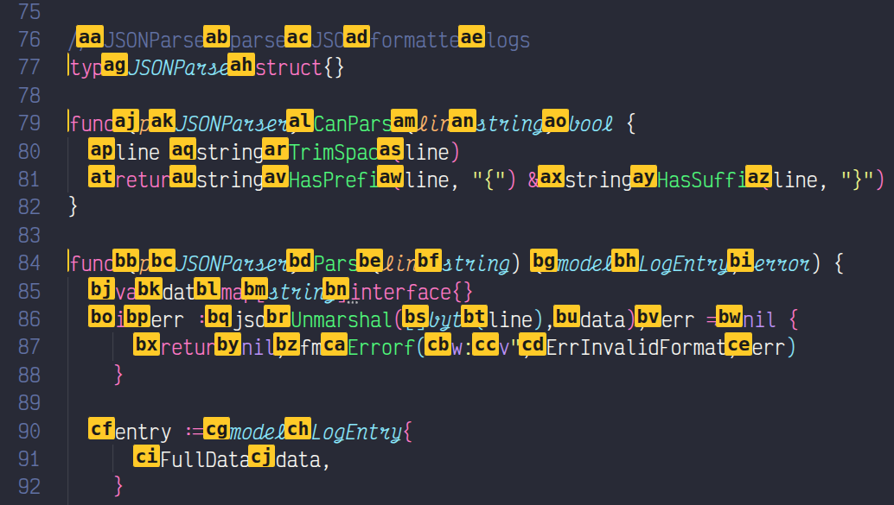

# navz

navz is a keyboard-first navigation extension for VS Code. It lets you move your cursor to any visible word in two keystrokes, and snap your viewport into place with a single chord — no mouse, no repeated arrow keys, no scrolling to find where you were.

Extension: https://marketplace.visualstudio.com/items?itemName=vish-navz.navz

## Jump to any word

Press `Alt+Enter` to enter jump mode. Every word on screen gets a two-letter label. Type the first letter — non-matching labels dim immediately, confirming your input. Type the second letter and your cursor lands there instantly.

Press `Escape` at any point to cancel.

### Select to a word

`Alt+Shift+Enter` works the same way, but instead of just moving the cursor it extends your selection from the current position to the target word. If you already have a selection, the anchor is preserved and only the active end moves.

## Scroll your view

Sometimes you don't need to move your cursor — you just need the code you're reading centered on screen. navz gives you two chords for that:

- `Ctrl+I C` — scroll the current line to the **c**enter of the viewport
- `Ctrl+I T` — scroll the current line to the **t**op of the viewport

Your cursor stays exactly where it is.

## Keybindings

| Keybinding | Description |
|-----------|-------------|
| `Alt+Enter` | Jump cursor to a word |
| `Alt+Shift+Enter` | Select from cursor to a word |
| `Escape` | Exit jump mode |
| `Ctrl+I C` | Scroll current line to center |
| `Ctrl+I T` | Scroll current line to top |

## Known limitations

- Up to 676 words can be labeled at once (26×26 codes: `aa`–`zz`). On very large viewports this limit may be reached.
- Conflicts with extensions that also override the `type` command (e.g. some Vim emulators). navz will show a warning and exit gracefully if this happens.

## Release notes

### 0.0.1

Initial release.
